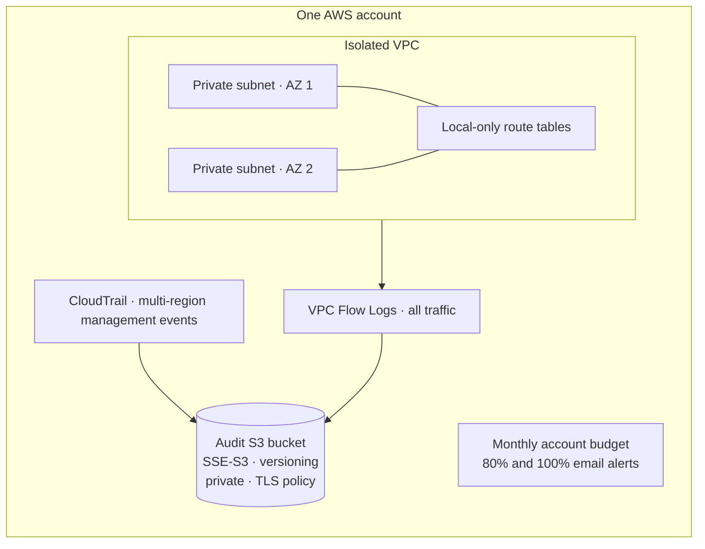

# AWS Secure Foundation (Terraform)

An **independent, single-account cloud architecture reference project** for a small AWS lab. It defines an isolated two-AZ VPC, centralized S3 audit storage, multi-region management-event CloudTrail, VPC Flow Logs, and an account-wide budget alert. No AWS resources have been created for this portfolio project.

This repository demonstrates infrastructure as code, security-oriented design, cost awareness, and change review. It is a starting point for a lab, **not** a complete organization landing zone or a production compliance claim.

## Architecture



The network has no internet gateway, NAT gateway, public subnet, workload, or interface endpoint. The budget warns about spend but does not cap it. See [architecture details](docs/architecture.md) and [security decisions](docs/security-decisions.md).

## What the code provides

| Area | Implemented control |
| --- | --- |
| Network | Two private `/24` subnets in distinct availability zones; local-only route tables; no public IP assignment |
| Audit | Multi-region CloudTrail management events with log-file validation and VPC Flow Logs for all traffic |
| Storage | S3 Block Public Access, bucket-owner-enforced ownership, SSE-S3, versioning, TLS-only bucket policy, configurable retention |
| Access | Service-specific S3 write grants with SourceArn/SourceAccount conditions; AWS provider restricted to an expected account ID |
| Cost | No NAT/compute resources; account-wide budget email alerts at 80% and 100%; a local plan guard rejects unreviewed resource types |
| Delivery | GitHub Actions workflow is configured to run Terraform format/validate and offline plan-guard tests without AWS credentials |

## Offline validation

Prerequisites: Terraform 1.6+ and Python 3.10+. Terraform pins the HashiCorp AWS provider to 6.66.0. The Python tests use only the standard library.

```bash
python3 -m unittest discover -s tests -v
terraform fmt -check -recursive terraform
terraform -chdir=terraform init -backend=false -input=false
terraform -chdir=terraform validate -no-color
```

The `plan_guard.py` tests use **synthetic JSON plans**. They prove that the gate rejects an internet gateway, deletion, a public subnet, disabled trail validation, and missing audit policy; they do not prove any AWS deployment.

**Preparation status (2026-10-08):** seven Python tests passed and the CI YAML parsed locally. Terraform was not installed in the preparation workspace, so provider initialization, `terraform fmt`, and `terraform validate` were not run locally. The workflow is configured to run them in GitHub Actions. No AWS plan or apply has been run.

## Reviewing an AWS plan later

Only use an AWS lab account you control. Copy `terraform/terraform.tfvars.example` to `terraform/terraform.tfvars`, then replace the placeholder account ID and email. That file is ignored by Git. Confirm the account and expected charges before planning.

```bash
terraform -chdir=terraform init
terraform -chdir=terraform plan -out=review.tfplan
terraform -chdir=terraform show -json review.tfplan > review.json
python3 scripts/plan_guard.py review.json
```

`terraform.tfvars`, state, plans, and plan JSON can contain sensitive details; keep them out of Git. The provider's `allowed_account_ids` check prevents applying to a different AWS account. A real deployment should use a protected remote state backend with locking and tightly scoped CI credentials. This project does not automatically apply changes.

## Cost and scope

CloudTrail, S3 requests/storage, VPC Flow Logs, and AWS Budgets may incur charges; a second management trail may add CloudTrail charges. Budget alerts are delayed and **do not prevent charges**. The sample audit lifecycle expires current objects after 90 days and noncurrent versions after 30 days; change these for actual retention rules. See [operations](docs/operations.md) for review and teardown notes.

This design intentionally does not manage an AWS Organization, SCPs, identity federation, root MFA, AWS Config, GuardDuty, workload compute, KMS customer-managed keys, or disaster recovery. It also does not claim production hardening. Those require account context, identity ownership, threat modeling, and ongoing operational review.

## Repository map

- [`terraform/`](terraform/) — AWS resource configuration and example input values
- [`scripts/plan_guard.py`](scripts/plan_guard.py) — offline policy gate for Terraform JSON plans
- [`tests/`](tests/) — synthetic negative and positive plan tests
- [`docs/architecture.md`](docs/architecture.md) — data flow and resource inventory
- [`docs/security-decisions.md`](docs/security-decisions.md) — threat/control/tradeoff record
- [`docs/operations.md`](docs/operations.md) — safe planning, verification, and retirement

## References

The service policy conditions follow [AWS CloudTrail's S3 bucket policy guidance](https://docs.aws.amazon.com/awscloudtrail/latest/userguide/create-s3-bucket-policy-for-cloudtrail.html) and [AWS VPC Flow Logs' S3 permissions guidance](https://docs.aws.amazon.com/vpc/latest/userguide/flow-logs-s3-permissions.html). Resource syntax follows the [HashiCorp AWS provider documentation](https://registry.terraform.io/providers/hashicorp/aws/latest/docs).

MIT licensed. Portfolio project prepared for Peter Adepoju, 2026.
